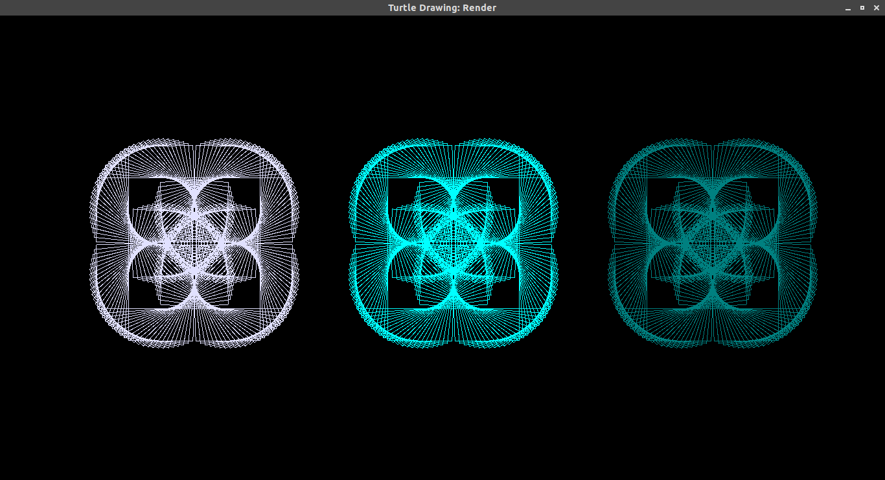
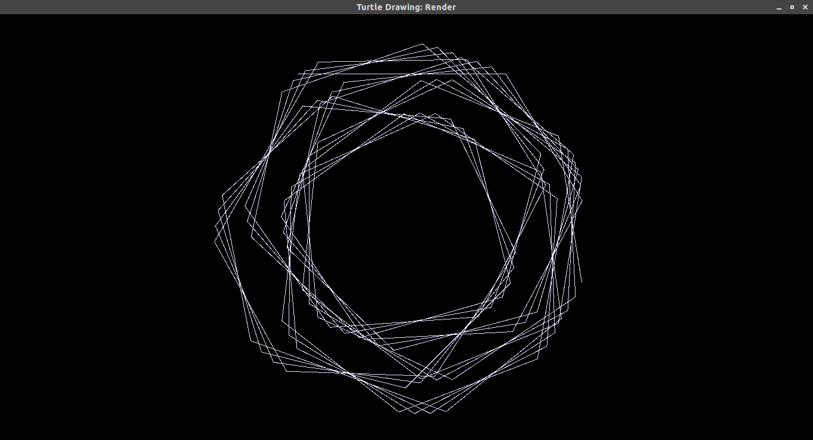

# Turtle Drawing

The goal of this school project is to create a drawing tool based on the moves of a Cursor

- [Turtle Drawing](#turtle-drawing)
  - [Project Architecture](#project-architecture)
  - [Documentation](#documentation)
  - [Compiling](#compiling)
  - [Running](#running)
  - [Examples](#examples)
    - [Pre made examples](#pre-made-examples)
    - [Other ones](#other-ones)
      - [Rotating rectangles](#rotating-rectangles)
      - [Weird](#weird)

## Project Architecture

- *bin/* contains all the binary compiled runnable files
- *build/* contains all the compiled object files
- *doc/* contains all the documentation files at the Markdown, HTML, and PDF format
- *examples/* contains multiple folder that are each an example and contains a running script and a txt files
- *include/* is empty but would have contained third party includes
- *spikes/* contains small scripts for testing methods and libraries
- *src/* contains all the source files

## Documentation

- Turtle Drawing instructions ([markdown](./doc/markdown/TurtleDrawing.md), [html](./doc/html/TurtleDrawing.html), [pdf](./doc/pdf/TurtleDrawing.pdf))

## Compiling

```bash
make build
```

## Running

It is recommended to clean old objects before running:

```bash
make clean run
```

Or

```bash
make clean build
./bin/app InstructionFile.txt
```

## Examples

### Pre made examples

```bash
make clean run SCRIPT=./examples/{example_name}/run.sh
```

```bash
make clean build
./examples/{example_name}/run.sh
```

### Other ones

#### Rotating rectangles

**Instructions:**

```txt
setposition 250 250

block rotating_rectangle
    repeat 45
        forward 200
        rotate 89
        forward 100
        rotate 89

repeat 4
    call rotating_rectangle
    forward 100

setdefault
setposition 650 250

repeat 4
    setcolor 0 255 255
    call rotating_rectangle
    forward 100

setdefault
setposition 1050 250

repeat 4
    setcolorhex 008080
    call rotating_rectangle
    forward 100
```

**Render:**



#### Weird

**Instructions:**

```text
setposition 500 100

repeat 5
    forward 100
    repeat 20
        forward 250
        rotate 59
```

**Render:**

